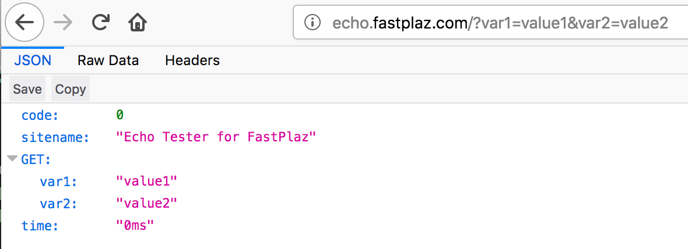
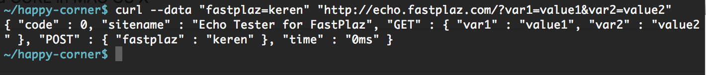
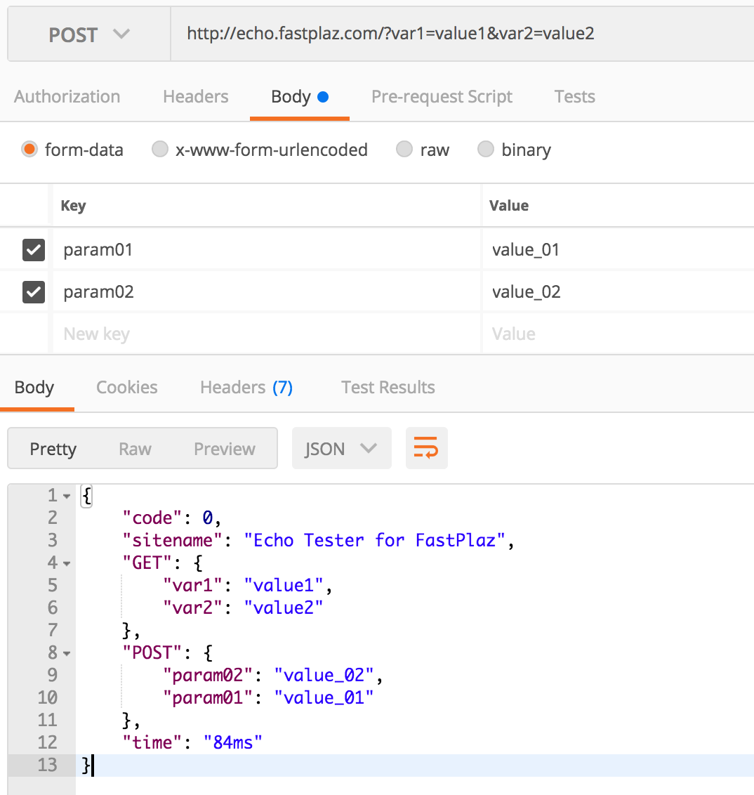

# ECHO Tester with FastPlaz

### Live Echo Tester

Try echo site : 
[http://echo.fastplaz.com/?var1=value1&var2=value2](http://echo.fastplaz.com/?var1=value1&var2=value2)

You can use GET or POST method.

## TRY THIS FIRST

For you guys that want to try fastplaz without need to compile, download this file:
[http://echo.fastplaz.com/files/echo.zip](http://echo.fastplaz.com/files/echo.zip)

Same content with this repository, but just have 1 additional binary file for linux environment.

Follow this step:

1. Upload all files in folder 'public\_html/' to your website's homedir.
if you use cpanel hosint, usually in folder '/home/username/public\_html/'


2. Make write permission to folder 'ztemp/', ex:
```chmod -R 777 ztemp/```

then try access from your browser with this format url:

[http://yourdomain/?var1=value1&var2=value2](http://yourdomain/?var1=value1&var2=value2)

The result should be like this:

from browser:


using curl from console:



using postman:


Cheers ....!
